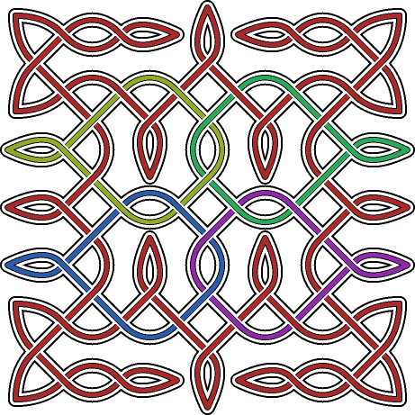

# Knotter-Learning
Sharing my Knotter files as I work through tutorials.

# Knotter
[Knotter](https://knotter.mattbas.org/Knotter) is a program for making Celtic and other knot type designs. It is a GUI program but you can also work directly with the XML of the .knot files.

